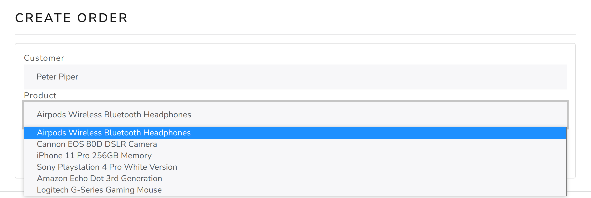

# 
Flask CRM

___

### Vision

“Flask CRM” is a web application that allows users to record information 
about clients, products, and orders.

The application should provide:

- Storing customers, products, and orders in a database;
- Display the list of customers, products, and orders;
- Updating the list of customers, products, and orders (adding, editing, removing);
- Display number of customers, products, and orders;
- Display information about a specific customer, product, and order;
- Search customers and products.

### 1. Dashboard

***Main scenario:***
- The user selects *"Home"* menu item;
- Application dashboard is displayed.

Pic. 1.1 Dashboard

### 2. Customers

#### 2.1 Display list of customers

***Main scenario:***
- The user selects *"Customers"* menu item;
- Application displays list of customers.

Pic. 2.1 List of customers

The list displays the following columns:

- \# - the unique number of the customer in the list;
- Customer - name and surname of the customer;
- Email - customer email;
- Phone - customer phone;
- Orders - the number of orders belonging to the customer.

#### 2.2 Add customer

***Main scenario:***
- The user clicks the *"Create customer"* button in the customers list view mode;
- Application displays form to enter customer data;
- The user enters customer data and presses the *“Submit”* button;
- If entered data is valid, then record is adding to database;
- If error occurs, then error message is displaying;
- If a new customer record is successfully added, then display the
list of customers with added record and a success message.

Pic. 2.2 Add customer

When adding a customer, the following details are entered:

- Customer name - name of the customer;
- Customer surname - surname of the customer;
- Customer email - email of the customer;
- Customer phone - phone of the customer.

#### 2.3 Edit customer

***Main scenario:***
- The user clicks the *"View"* button in the customers list view mode;
- Application redirects user to the customer detail page with the *"Edit"* button;
- The user clicks the *"Edit"* button, then the customer form appeared;
- The user enters customer data and presses the *“Submit”* button;
- If entered data is valid, the corresponding record is updated in the database, 
  and message indicating success is displayed;
- If error occurs, then error message is displayed;

Pic. 2.3 Edit customer

When editing a customer, the following details are entered:

- Customer name - name of the customer;
- Customer surname - surname of the customer;
- Customer email - email of the customer;
- Customer phone - phone of the customer.

#### 2.4 Delete customer

***Main scenario:***
- The user clicks the *"Delete"* button in the customer detail page, 
then appears warning window;
- The user confirms the removal of the customer;
- Record is deleted from database;
- If the customer record is successfully deleted, the message 
indicating success is displayed.
 

Pic. 2.4 Delete customer

Cancel operation scenario:

- The user is in the display mode of the customers list
and press the *“Delete”* button;
- Application displays confirmation dialog “Are you sure that you want 
  to delete the customer?”;
- User press the “No” button;
- The list of customer stays without changing.

### 3. Products

#### 3.1 Display list of Products

***Main scenario:***
- The user selects *"Products"* menu item;
- Application displays list of products.

Pic. 3.1 List of products

The list displays the following columns:

- \# - the unique number of the product in the list;
- Product - name of the product;
- Price - price of the product;
- Date created - the date when the product was added.

#### 3.2 Add product

***Main scenario:***
- The user clicks the *"Create product"* button in the products list view mode;
- Application displays form to enter the product data;
- The user enters product data and presses the *“Submit”* button;
- If entered data is valid, then record is adding to database;
- If error occurs, then error message is displaying;
- If a new product record is successfully added, then display the
list of products with added record and a success message.

Pic. 3.2 Add product

When adding a product, the following details are entered:

- Product - name of the product;
- Price - price of the product;
- Description - description of the product.

#### 3.3 Edit product

***Main scenario:***
- The user clicks the *"View"* button in the products list view mode;
- Application redirects user to the product detail page with the *"Edit"* button;
- The user clicks the *"Edit"* button, then the product form appeared;
- The user enters product data and presses the *“Submit”* button;
- If entered data is valid, the corresponding record is updated in the database, 
  and message indicating success is displayed;
- If error occurs, then error message is displayed.

Pic. 3.3 Edit product

When editing a product, the following details are entered:

- Product - name of the product;
- Price - price of the product;
- Description - description of the product.

#### 3.4 Delete product

***Main scenario:***
- The user clicks the *"Delete"* button in the product detail page, 
then appears warning window;
- The user confirms the removal of the product;
- Record is deleted from database;
- If the product record is successfully deleted, the message indicating success is displayed.
 

Pic. 3.4 Delete product

Cancel operation scenario:

- The user is in the display mode of the products list
and press the *“Delete”* button;
- Application displays confirmation dialog “Are you sure that you want 
to delete the product?”;
- User press the “No” button;
- The list of product stays without changing.

### 4. Orders

#### 4.1 Display list of Orders

***Main scenario:***
- The user selects *"Orders"* menu item;
- Application displays list of orders.

Pic. 4.1 List of Orders

The list displays the following columns:

- \# - the unique number of the order in the list;
- Customer - name of the customer which the order belongs;
- Product - price of the product in order;
- Date created - the date when the order was added.

#### 4.2 Add order

***Main scenario:***
- The user clicks the *"Create order"* button in the orders list view mode;
- Application redirects user to the order management page with the order creation form;
- The user chooses customer, product, and presses the "Submit" button;
- If a new order record is successfully added, then display the
list of orders with added records and a success message.

Pic. 4.2 Add order

When adding an order, the following fields are choosing:

- Customer - name of the customer;
- Product - the product in order;

#### 4.3 Edit order

***Main scenario:***
- The user clicks the *"Update"* button in the orders list view mode;
- Application redirects user to the order management page with the order update form;
- The user chooses customer, product, and presses the "Submit" button;
- If entered data is valid, the corresponding record is updated in the database, 
  and message indicating success is displayed.

Pic. 4.3 Update order

When editing an order, the following fields are choosing:

- Customer - name of the customer;
- Product - the product in order;

#### 4.4 Delete order

***Main scenario:***
- The user, while in the list of orders, presses the *"Cancel"* button 
in the selected order line;
- The user confirms the removal of the order;
- Record is deleted from database;
- If the order record is successfully deleted, the message indicating success is displayed.
 

Pic. 4.4 Delete order

Cancel operation scenario:

- The user is in the display mode of the orders list
and press the *“Cancel”* button;
- Application displays confirmation dialog “Are you sure that you want 
  to delete the order?”;
- User press the “No” button;
- The list of order stays without changing.